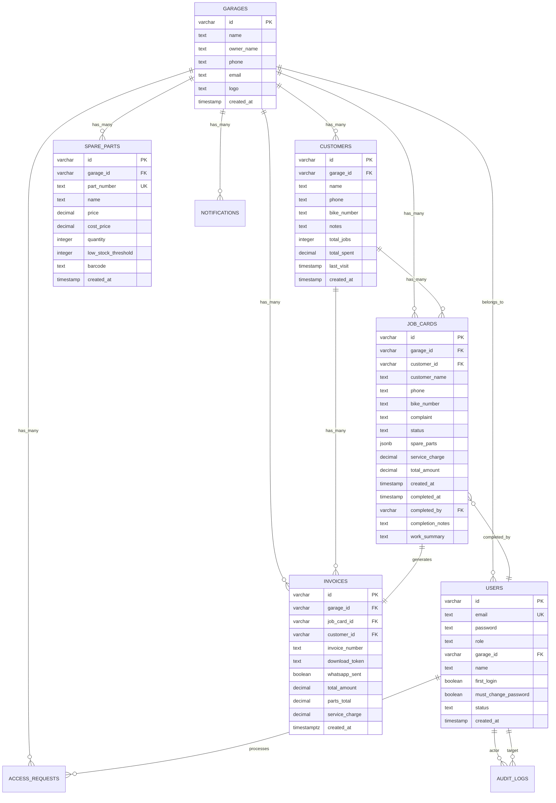

# GarageGuru Database Schema Documentation

## Overview

GarageGuru uses PostgreSQL as its primary database with a well-structured schema designed for multi-tenant garage management. The database supports role-based access control, audit logging, and comprehensive business operations tracking.

## Database Connection

- **Provider**: Render.com PostgreSQL (Neon-backed)
- **ORM**: Drizzle ORM with type-safe schema definitions
- **Migrations**: Automatic schema creation on server startup
- **Connection Pool**: PostgreSQL native driver with connection pooling

## Schema Design Principles

1. **Multi-tenant Architecture**: Complete data isolation between garages
2. **Role-based Security**: User permissions enforced at database level
3. **Audit Trail**: Complete logging of critical operations
4. **Data Integrity**: Foreign key constraints and proper indexing
5. **Type Safety**: Drizzle ORM ensures compile-time type checking

## Core Tables

### 1. Garages Table
**Purpose**: Multi-tenant garage management

```sql
CREATE TABLE garages (
    id VARCHAR PRIMARY KEY DEFAULT gen_random_uuid(),
    name TEXT NOT NULL,
    owner_name TEXT NOT NULL,
    phone TEXT NOT NULL,
    email TEXT NOT NULL,
    logo TEXT,
    created_at TIMESTAMP DEFAULT NOW()
);
```

**TypeScript Schema:**
```typescript
export const garages = pgTable("garages", {
  id: varchar("id").primaryKey().default(sql`gen_random_uuid()`),
  name: text("name").notNull(),
  ownerName: text("owner_name").notNull(),
  phone: text("phone").notNull(),
  email: text("email").notNull(),
  logo: text("logo"), // Server-side file path
  createdAt: timestamp("created_at").defaultNow(),
});
```

**Key Fields:**
- `id`: UUID primary key
- `name`: Garage business name
- `owner_name`: Garage owner's full name
- `phone`: Contact phone number
- `email`: Business email address
- `logo`: Server-side file path for garage logo
- `created_at`: Registration timestamp

### 2. Users Table
**Purpose**: User authentication and role management

```sql
CREATE TABLE users (
    id VARCHAR PRIMARY KEY DEFAULT gen_random_uuid(),
    email TEXT NOT NULL UNIQUE,
    password TEXT NOT NULL,
    role TEXT NOT NULL,
    garage_id VARCHAR REFERENCES garages(id),
    name TEXT NOT NULL,
    first_login BOOLEAN DEFAULT true,
    must_change_password BOOLEAN DEFAULT false,
    status TEXT NOT NULL DEFAULT 'active',
    created_at TIMESTAMP DEFAULT NOW()
);
```

**TypeScript Schema:**
```typescript
export const users = pgTable("users", {
  id: varchar("id").primaryKey().default(sql`gen_random_uuid()`),
  email: text("email").notNull().unique(),
  password: text("password").notNull(),
  role: text("role").notNull(), // 'garage_admin', 'mechanic_staff', 'super_admin'
  garageId: varchar("garage_id").references(() => garages.id),
  name: text("name").notNull(),
  firstLogin: boolean("first_login").default(true),
  mustChangePassword: boolean("must_change_password").default(false),
  status: text("status").notNull().default("active"), // 'active', 'suspended'
  createdAt: timestamp("created_at").defaultNow(),
});
```

**Role Definitions:**
- `super_admin`: System-wide access, garage management
- `garage_admin`: Full garage operations, staff management
- `mechanic_staff`: Job card management, limited access

### 3. Customers Table
**Purpose**: Customer management with service history

```sql
CREATE TABLE customers (
    id VARCHAR PRIMARY KEY DEFAULT gen_random_uuid(),
    garage_id VARCHAR NOT NULL REFERENCES garages(id),
    name TEXT NOT NULL,
    phone TEXT NOT NULL,
    bike_number TEXT NOT NULL,
    notes TEXT,
    total_jobs INTEGER DEFAULT 0,
    total_spent DECIMAL(10,2) DEFAULT 0,
    last_visit TIMESTAMP,
    created_at TIMESTAMP DEFAULT NOW()
);
```

**TypeScript Schema:**
```typescript
export const customers = pgTable("customers", {
  id: varchar("id").primaryKey().default(sql`gen_random_uuid()`),
  garageId: varchar("garage_id").notNull().references(() => garages.id),
  name: text("name").notNull(),
  phone: text("phone").notNull(),
  bikeNumber: text("bike_number").notNull(),
  notes: text("notes"),
  totalJobs: integer("total_jobs").default(0),
  totalSpent: decimal("total_spent", { precision: 10, scale: 2 }).default("0"),
  lastVisit: timestamp("last_visit"),
  createdAt: timestamp("created_at").defaultNow(),
});
```

**Business Rules:**
- **Duplicate Prevention**: Unique bike numbers per garage
- **Auto-calculated Fields**: `total_jobs` and `total_spent` updated via triggers
- **Service History**: Linked to job cards for complete tracking

### 4. Spare Parts Table
**Purpose**: Inventory management with cost tracking

```sql
CREATE TABLE spare_parts (
    id VARCHAR PRIMARY KEY DEFAULT gen_random_uuid(),
    garage_id VARCHAR NOT NULL REFERENCES garages(id),
    part_number TEXT NOT NULL UNIQUE,
    name TEXT NOT NULL,
    price DECIMAL(10,2) NOT NULL,
    cost_price DECIMAL(10,2) NOT NULL DEFAULT 0,
    quantity INTEGER NOT NULL DEFAULT 0,
    low_stock_threshold INTEGER DEFAULT 2,
    barcode TEXT,
    created_at TIMESTAMP DEFAULT NOW()
);
```

**TypeScript Schema:**
```typescript
export const spareParts = pgTable("spare_parts", {
  id: varchar("id").primaryKey().default(sql`gen_random_uuid()`),
  garageId: varchar("garage_id").notNull().references(() => garages.id),
  partNumber: text("part_number").notNull().unique(),
  name: text("name").notNull(),
  price: decimal("price", { precision: 10, scale: 2 }).notNull(), // Selling price
  costPrice: decimal("cost_price", { precision: 10, scale: 2 }).notNull().default("0"), // Cost price
  quantity: integer("quantity").notNull().default(0),
  lowStockThreshold: integer("low_stock_threshold").default(2),
  barcode: text("barcode"),
  createdAt: timestamp("created_at").defaultNow(),
});
```

**Key Features:**
- **Profit Tracking**: Separate cost price and selling price
- **Stock Management**: Quantity tracking with low-stock alerts
- **Barcode Support**: Multiple barcode format support
- **Duplicate Prevention**: Unique part numbers across system

### 5. Job Cards Table
**Purpose**: Service request management and tracking

```sql
CREATE TABLE job_cards (
    id VARCHAR PRIMARY KEY DEFAULT gen_random_uuid(),
    garage_id VARCHAR NOT NULL REFERENCES garages(id),
    customer_id VARCHAR NOT NULL REFERENCES customers(id),
    customer_name TEXT NOT NULL,
    phone TEXT NOT NULL,
    bike_number TEXT NOT NULL,
    complaint TEXT NOT NULL,
    status TEXT NOT NULL DEFAULT 'pending',
    spare_parts JSONB DEFAULT '[]',
    service_charge DECIMAL(10,2) DEFAULT 0,
    total_amount DECIMAL(10,2) DEFAULT 0,
    created_at TIMESTAMP DEFAULT NOW(),
    completed_at TIMESTAMP,
    completed_by VARCHAR REFERENCES users(id),
    completion_notes TEXT,
    work_summary TEXT
);
```

**TypeScript Schema:**
```typescript
export const jobCards = pgTable("job_cards", {
  id: varchar("id").primaryKey().default(sql`gen_random_uuid()`),
  garageId: varchar("garage_id").notNull().references(() => garages.id),
  customerId: varchar("customer_id").notNull().references(() => customers.id),
  customerName: text("customer_name").notNull(),
  phone: text("phone").notNull(),
  bikeNumber: text("bike_number").notNull(),
  complaint: text("complaint").notNull(),
  status: text("status").notNull().default("pending"), // 'pending', 'completed'
  spareParts: jsonb("spare_parts").$type<Array<{id: string, partNumber: string, name: string, quantity: number, price: number}>>().default([]),
  serviceCharge: decimal("service_charge", { precision: 10, scale: 2 }).default("0"),
  totalAmount: decimal("total_amount", { precision: 10, scale: 2 }).default("0"),
  createdAt: timestamp("created_at").defaultNow(),
  completedAt: timestamp("completed_at"),
  completedBy: varchar("completed_by").references(() => users.id), // User who completed the job
  completionNotes: text("completion_notes"), // Notes about the work done
  workSummary: text("work_summary"), // Summary of work performed
});
```

**JSONB Spare Parts Structure:**
```typescript
type JobCardSparePart = {
  id: string;           // Spare part ID
  partNumber: string;   // Part number for reference
  name: string;         // Part name for display
  quantity: number;     // Quantity used
  price: number;        // Price at time of use
};
```

### 6. Invoices Table
**Purpose**: Billing and payment tracking

```sql
CREATE TABLE invoices (
    id VARCHAR PRIMARY KEY DEFAULT gen_random_uuid(),
    garage_id VARCHAR NOT NULL REFERENCES garages(id),
    job_card_id VARCHAR NOT NULL REFERENCES job_cards(id),
    customer_id VARCHAR NOT NULL REFERENCES customers(id),
    invoice_number TEXT NOT NULL,
    download_token TEXT,
    whatsapp_sent BOOLEAN DEFAULT false,
    total_amount DECIMAL(10,2) NOT NULL,
    parts_total DECIMAL(10,2) NOT NULL,
    service_charge DECIMAL(10,2) NOT NULL,
    created_at TIMESTAMP WITH TIME ZONE DEFAULT NOW()
);
```

**TypeScript Schema:**
```typescript
export const invoices = pgTable("invoices", {
  id: varchar("id").primaryKey().default(sql`gen_random_uuid()`),
  garageId: varchar("garage_id").notNull().references(() => garages.id),
  jobCardId: varchar("job_card_id").notNull().references(() => jobCards.id),
  customerId: varchar("customer_id").notNull().references(() => customers.id),
  invoiceNumber: text("invoice_number").notNull(),
  downloadToken: text("download_token"), // Unique token for PDF download URL
  whatsappSent: boolean("whatsapp_sent").default(false),
  totalAmount: decimal("total_amount", { precision: 10, scale: 2 }).notNull(),
  partsTotal: decimal("parts_total", { precision: 10, scale: 2 }).notNull(),
  serviceCharge: decimal("service_charge", { precision: 10, scale: 2 }).notNull(),
  createdAt: timestamp("created_at", { withTimezone: true }).defaultNow(),
});
```

**Invoice Number Format**: `INV-YYYYMMDD-{random6chars}`

## Supporting Tables

### 7. Notifications Table
**Purpose**: System notifications and alerts

```sql
CREATE TABLE notifications (
    id VARCHAR PRIMARY KEY DEFAULT gen_random_uuid(),
    garage_id VARCHAR NOT NULL REFERENCES garages(id),
    customer_id VARCHAR REFERENCES customers(id),
    type VARCHAR NOT NULL,
    title VARCHAR NOT NULL,
    message TEXT NOT NULL,
    is_read BOOLEAN DEFAULT false,
    data JSONB,
    created_at TIMESTAMP DEFAULT NOW()
);
```

**Notification Types:**
- `milestone`: Customer service milestones
- `low_stock`: Inventory alerts
- `system`: System-wide announcements

### 8. OTP Records Table
**Purpose**: Multi-factor authentication and password reset

```sql
CREATE TABLE otp_records (
    id VARCHAR PRIMARY KEY DEFAULT gen_random_uuid(),
    email TEXT NOT NULL,
    hashed_otp TEXT NOT NULL,
    salt TEXT NOT NULL,
    purpose TEXT NOT NULL,
    attempts INTEGER DEFAULT 0,
    used BOOLEAN DEFAULT false,
    expires_at TIMESTAMP NOT NULL,
    created_at TIMESTAMP DEFAULT NOW()
);
```

**Security Features:**
- **Hashed OTP**: bcrypt with individual salt
- **Rate Limiting**: Maximum 3 attempts per OTP
- **Expiration**: 10-minute validity window
- **Single Use**: OTP invalidated after successful use

### 9. Audit Logs Table
**Purpose**: Security and compliance logging

```sql
CREATE TABLE audit_logs (
    id VARCHAR PRIMARY KEY DEFAULT gen_random_uuid(),
    actor_id VARCHAR NOT NULL,
    actor_email TEXT NOT NULL,
    target_user_id VARCHAR,
    target_email TEXT,
    action TEXT NOT NULL,
    details JSONB,
    garage_id VARCHAR REFERENCES garages(id),
    created_at TIMESTAMP DEFAULT NOW()
);
```

**Logged Actions:**
- `role_change`: User role modifications
- `password_change`: Password updates
- `login`: Successful authentication
- `garage_create`: New garage creation
- `user_create`: New user registration

### 10. Access Requests Table
**Purpose**: Staff access request management

```sql
CREATE TABLE access_requests (
    id VARCHAR PRIMARY KEY DEFAULT gen_random_uuid(),
    garage_id VARCHAR NOT NULL REFERENCES garages(id),
    user_id VARCHAR NOT NULL,
    email TEXT NOT NULL,
    name TEXT NOT NULL,
    requested_role TEXT NOT NULL,
    status TEXT NOT NULL DEFAULT 'pending',
    note TEXT,
    processed_by VARCHAR,
    processed_at TIMESTAMP,
    created_at TIMESTAMP DEFAULT NOW()
);
```

**Workflow:**
1. Staff user submits access request
2. Email notification sent to garage admin
3. Admin approves/denies request
4. User receives notification and gains access

## Database Relationships



## Data Types and Constraints

### Decimal Precision
All monetary values use `DECIMAL(10,2)` for exact precision:
- **Maximum Value**: 99,999,999.99
- **Precision**: 2 decimal places
- **Use Cases**: Prices, amounts, totals, costs

### UUID Generation
All primary keys use PostgreSQL's `gen_random_uuid()` function:
- **Format**: Standard RFC 4122 UUID v4
- **Uniqueness**: Cryptographically secure random generation
- **Performance**: Indexed for fast lookups

### JSONB Usage
Job cards store spare parts as JSONB arrays:
```json
[
  {
    "id": "part-uuid",
    "partNumber": "BP001",
    "name": "Brake Pad Set",
    "quantity": 1,
    "price": 1200
  }
]
```

**Advantages:**
- **Flexible Structure**: Easy addition of part metadata
- **Query Performance**: GIN indexing for fast searches
- **Data Integrity**: Structured data validation

## Indexes and Performance

### Primary Indexes
- All tables have UUID primary keys with automatic indexing
- Foreign key constraints create automatic indexes

### Recommended Additional Indexes
```sql
-- User lookup by email (authentication)
CREATE INDEX idx_users_email ON users(email);

-- Customer search by garage
CREATE INDEX idx_customers_garage ON customers(garage_id);

-- Job card status filtering
CREATE INDEX idx_job_cards_status ON job_cards(garage_id, status);

-- Invoice date range queries
CREATE INDEX idx_invoices_created_at ON invoices(garage_id, created_at);

-- Spare parts search
CREATE INDEX idx_spare_parts_search ON spare_parts(garage_id, name, part_number);
```

## Database Migration Strategy

### Automatic Migrations
The application uses automatic schema creation on startup:

```typescript
// server/migrations.ts
export async function runMigrations() {
  console.log('🔄 Running database migrations...');
  
  // Create all tables with IF NOT EXISTS
  await createTables();
  
  // Run data migrations if needed
  await fixDataInconsistencies();
  
  console.log('✅ Database migrations completed successfully');
}
```

### Migration Process
1. **Schema Creation**: Tables created with `IF NOT EXISTS`
2. **Data Validation**: Existing data validated and fixed
3. **Index Creation**: Performance indexes added automatically
4. **Constraint Validation**: Foreign key integrity checked

## Data Consistency and Integrity

### Triggers and Calculated Fields

#### Customer Statistics Update
```sql
-- Trigger to update customer totals when job completed
CREATE OR REPLACE FUNCTION update_customer_stats()
RETURNS TRIGGER AS $$
BEGIN
    UPDATE customers 
    SET 
        total_jobs = (
            SELECT COUNT(*) 
            FROM job_cards 
            WHERE customer_id = NEW.customer_id 
            AND status = 'completed'
        ),
        total_spent = (
            SELECT COALESCE(SUM(total_amount), 0) 
            FROM invoices 
            WHERE customer_id = NEW.customer_id
        ),
        last_visit = NOW()
    WHERE id = NEW.customer_id;
    RETURN NEW;
END;
$$ LANGUAGE plpgsql;
```

### Soft Delete Strategy
The system uses status fields instead of hard deletes:
- **Users**: `status` field ('active', 'suspended')
- **Access Requests**: `status` field ('pending', 'approved', 'denied')
- **Audit Trail**: Complete history preservation

## Security Considerations

### Data Isolation
- **Multi-tenancy**: All queries filtered by `garage_id`
- **Role Enforcement**: Database-level access control
- **User Isolation**: Cross-garage data access prevented

### Password Security
- **Hashing**: bcrypt with salt rounds = 10
- **Storage**: Never store plain text passwords
- **Reset Process**: Secure OTP-based password reset

### Audit Trail
All critical operations logged with:
- **Actor Information**: Who performed the action
- **Target Details**: What was affected
- **Action Context**: Full operation details
- **Timestamp**: Precise timing information

## Performance Optimization

### Query Optimization
- **Connection Pooling**: PostgreSQL native driver with pools
- **Prepared Statements**: All queries use parameterized statements
- **Index Usage**: Strategic indexing for common query patterns
- **JSONB Queries**: Efficient spare parts filtering and searches

### Caching Strategy
- **Application Level**: TanStack Query for frontend caching
- **Database Level**: PostgreSQL query plan caching
- **Session Storage**: PostgreSQL-backed session management

## Backup and Recovery

### Automated Backups
- **Provider**: Render.com automatic backups
- **Frequency**: Daily automated snapshots
- **Retention**: 30-day backup retention
- **Point-in-time Recovery**: Available through provider

### Data Export
All data can be exported via API endpoints for:
- **Customer Lists**: Complete customer databases
- **Invoice History**: Financial record keeping
- **Inventory Reports**: Stock and cost analysis
- **Audit Trails**: Compliance and security reporting

This database schema provides a robust foundation for the GarageGuru application, ensuring data integrity, security, and scalability for multi-tenant garage operations.