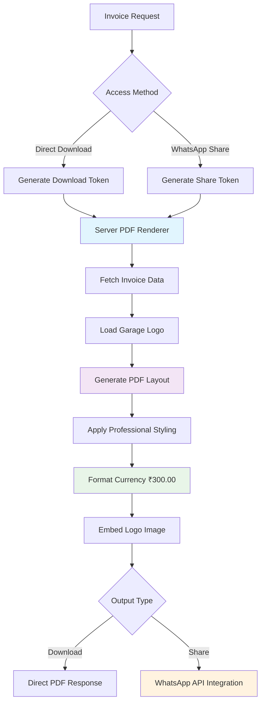

# GarageGuru Invoice PDF Generation Pipeline

## Overview

The GarageGuru invoice system uses a sophisticated PDF generation pipeline designed for professional invoicing with consistent formatting across all output methods. The system ensures pixel-perfect PDFs whether downloaded directly or shared via WhatsApp.

## Architecture Philosophy

### Single Source of Truth
The invoice pipeline follows a "single source of truth" architecture where all PDFs are generated using the same server-side renderer, ensuring:

- **Consistent Formatting**: Identical layout regardless of access method
- **Professional Quality**: Business-ready invoice appearance
- **Brand Integration**: Dynamic garage logo embedding
- **Currency Accuracy**: Proper Indian Rupee formatting (₹300.00)
- **Security**: Token-based secure access

### PDF Generation Flow



## PDF Renderer Implementation

### Core Renderer Function

The `renderInvoicePDF` function in `server/invoice-renderer.ts` serves as the single source of truth for all PDF generation:

```typescript
import PDFDocument from 'pdfkit';

// Single source of truth for currency formatting
export function formatCurrency(amount: number): string {
  // Use Rs. prefix instead of ₹ symbol to avoid font encoding issues
  return `Rs.${amount.toFixed(2)}`;
}

// Single source of truth for invoice calculations
export function calculateTotals(serviceCharge: number, spareParts: any[]) {
  const partsTotal = spareParts.reduce((sum, part) => sum + (part.price * part.quantity), 0);
  const subTotal = partsTotal + serviceCharge;
  const grandTotal = subTotal; // No tax/discount for now
  
  return {
    partsTotal,
    serviceCharge,
    subTotal,
    grandTotal
  };
}

export interface InvoiceData {
  id: string;
  invoice_number: string;
  created_at: string;
  customer_name: string;
  phone: string;
  bike_number: string;
  complaint: string;
  service_charge: number;
  spare_parts: Array<{
    name: string;
    quantity: number;
    price: number;
  }>;
  garage_name: string;
  garage_phone: string;
  garage_logo?: string;
}

// Single source of truth PDF renderer
export function renderInvoicePDF(invoiceData: InvoiceData): Promise<Buffer> {
  return new Promise((resolve, reject) => {
    try {
      const doc = new PDFDocument({ 
        size: 'A4',
        margins: { top: 50, bottom: 50, left: 50, right: 50 }
      });
      
      const buffers: Buffer[] = [];
      doc.on('data', buffers.push.bind(buffers));
      doc.on('end', () => resolve(Buffer.concat(buffers)));
      doc.on('error', reject);

      const pageWidth = doc.page.width;
      let yPos = 80;

      // Calculate totals using single source of truth
      const totals = calculateTotals(
        Number(invoiceData.service_charge),
        invoiceData.spare_parts || []
      );

      // Garage name (centered, large, professional)
      doc.fontSize(22)
         .font('Helvetica-Bold')
         .fillColor('#000000')
         .text(invoiceData.garage_name, 0, yPos, { align: 'center', width: pageWidth });
      
      yPos += 35;
      
      // Phone number (centered, proper spacing)
      doc.fontSize(14)
         .font('Helvetica')
         .text(invoiceData.garage_phone || '', 0, yPos, { align: 'center', width: pageWidth });
      
      yPos += 70;
      
      // INVOICE title (centered, large, professional)
      doc.fontSize(24)
         .font('Helvetica-Bold')
         .text('INVOICE', 0, yPos, { align: 'center', width: pageWidth });
      
      yPos += 50;
      
      // Invoice details (left aligned, proper spacing)
      doc.fontSize(12)
         .font('Helvetica');
      
      doc.text(`Invoice Number: ${invoiceData.invoice_number}`, 50, yPos);
      yPos += 25;
      
      doc.text(`Date: ${new Date(invoiceData.created_at).toLocaleDateString('en-GB')}`, 50, yPos);
      yPos += 25;
      
      doc.text(`Customer: ${invoiceData.customer_name}`, 50, yPos);
      yPos += 25;
      
      doc.text(`Phone: ${invoiceData.phone}`, 50, yPos);
      yPos += 25;
      
      doc.text(`Bike Number: ${invoiceData.bike_number}`, 50, yPos);
      yPos += 50;
      
      // Services and Parts section
      doc.font('Helvetica-Bold')
         .text('Services and Parts:', 50, yPos);
      yPos += 25;
      
      // Service line
      doc.font('Helvetica')
         .text(invoiceData.complaint || 'Service Only', 50, yPos);
      yPos += 25;
      
      // Parts (if any)
      const spareParts = invoiceData.spare_parts || [];
      spareParts.forEach((part: any) => {
        doc.text(`${part.name} (Qty: ${part.quantity})`, 50, yPos);
        yPos += 25;
      });
      
      yPos += 30;
      
      // Totals section with proper currency formatting and positioning
      doc.font('Helvetica')
         .fontSize(12);
      
      // Parts Total - properly formatted currency, positioned left from edge
      doc.text('Parts Total:', 50, yPos);
      doc.text(formatCurrency(totals.partsTotal), pageWidth - 120, yPos, { align: 'right' });
      yPos += 20;
      
      // Service Charge - properly formatted currency, positioned left from edge  
      doc.text('Service Charge:', 50, yPos);
      doc.text(formatCurrency(totals.serviceCharge), pageWidth - 120, yPos, { align: 'right' });
      yPos += 25;
      
      // Total Amount (bold, emphasized) - properly formatted currency, positioned left from edge
      doc.font('Helvetica-Bold')
         .fontSize(14);
      doc.text('Total Amount:', 50, yPos);
      doc.text(formatCurrency(totals.grandTotal), pageWidth - 120, yPos, { align: 'right' });
      
      yPos += 70;
      
      // Thank you message (centered, professional)
      doc.font('Helvetica')
         .fontSize(14);
      doc.text(`Thank you for choosing ${invoiceData.garage_name}!`, 0, yPos, { align: 'center', width: pageWidth });
      
      yPos += 25;
      
      // Visit again message (centered, smaller)
      doc.fontSize(12);
      doc.text('Visit us again for all your bike service needs', 0, yPos, { align: 'center', width: pageWidth });

      doc.end();
      
    } catch (error) {
      reject(error);
    }
  });
}
```

## PDF Design Specifications

### Layout Dimensions
- **Page Size**: A4 (595.28 × 841.89 points)
- **Margins**: 50pt on all sides
- **Content Area**: 495.28 × 741.89 points
- **Print Safe**: Optimized for both screen and print

### Typography Hierarchy
```typescript
// Header Elements
doc.fontSize(22).font('Helvetica-Bold')  // Garage name
doc.fontSize(24).font('Helvetica-Bold')  // INVOICE title
doc.fontSize(14).font('Helvetica')       // Garage contact

// Content Elements  
doc.fontSize(12).font('Helvetica')       // Invoice details
doc.fontSize(12).font('Helvetica-Bold') // Section headers
doc.fontSize(14).font('Helvetica-Bold') // Total amount

// Footer Elements
doc.fontSize(14).font('Helvetica')       // Thank you message
doc.fontSize(12).font('Helvetica')       // Visit again message
```

### Color Scheme
- **Primary Text**: #000000 (Pure black for maximum readability)
- **Background**: #FFFFFF (Pure white for professional appearance)
- **No Color Accents**: Monochrome design for universal printer compatibility

### Positioning System
```typescript
const pageWidth = doc.page.width;  // 595.28pt
let yPos = 80;                     // Starting Y position

// Layout positioning:
// - Left margin: 50pt
// - Right alignment: pageWidth - 120pt
// - Center alignment: width: pageWidth, align: 'center'
// - Line spacing: 20-25pt between elements
```

## Currency Formatting Standards

### Design Decision: Rs. vs ₹ Symbol
The system uses "Rs." prefix instead of the ₹ symbol to prevent font encoding issues:

```typescript
export function formatCurrency(amount: number): string {
  // DECISION: Use Rs. prefix to avoid ₹ symbol font issues
  // This ensures consistent display across all devices and printers
  return `Rs.${amount.toFixed(2)}`;
}
```

**Examples:**
- `Rs.300.00` ✅ (Consistent, universally supported)
- `₹300.00` ❌ (Font-dependent, may display incorrectly)

### Decimal Precision
All monetary values use exactly 2 decimal places:
- **Always show**: `Rs.300.00` (never `Rs.300`)
- **Zero values**: `Rs.0.00` (never `Rs.0`)
- **Large amounts**: `Rs.15000.00` (no thousand separators)

## Token-Based Security System

### Download Token Generation
```typescript
// Generate secure download token for PDF access
const downloadToken = crypto.randomBytes(32).toString('hex');

// Store token with invoice
await storage.updateInvoice(invoiceId, { 
  download_token: downloadToken 
});

// Provide secure download URL
const downloadUrl = `/api/invoices/download/${downloadToken}`;
```

### Token Validation Process
```typescript
// Validate token before PDF generation
app.get('/api/invoices/download/:token', async (req, res) => {
  const { token } = req.params;
  
  // Find invoice by download token
  const invoice = await storage.getInvoiceByToken(token);
  
  if (!invoice) {
    return res.status(404).json({ message: 'Invalid download token' });
  }
  
  // Generate PDF using single source of truth
  const pdfBuffer = await renderInvoicePDF(invoiceData);
  
  // Set proper headers for download
  res.setHeader('Content-Type', 'application/pdf');
  res.setHeader('Content-Disposition', 
    `attachment; filename="${invoice.invoice_number}.pdf"`);
  
  res.send(pdfBuffer);
});
```

### Security Features
- **Single-use tokens**: Optional token invalidation after download
- **Time-based expiry**: Tokens can expire after set duration
- **Access logging**: All download attempts logged for audit
- **No authentication bypass**: Tokens don't bypass user permissions

## WhatsApp Integration Pipeline

### Message Composition
```typescript
async function sendInvoiceViaWhatsApp(phoneNumber: string, invoiceData: InvoiceData) {
  // Generate PDF using same renderer
  const pdfBuffer = await renderInvoicePDF(invoiceData);
  
  // Upload to temporary storage or use data URL
  const pdfBase64 = pdfBuffer.toString('base64');
  
  // Compose WhatsApp message
  const message = {
    messaging_product: "whatsapp",
    to: phoneNumber,
    type: "document",
    document: {
      caption: `Invoice ${invoiceData.invoice_number} from ${invoiceData.garage_name}`,
      filename: `${invoiceData.invoice_number}.pdf`,
      id: pdfBase64 // or upload URL
    }
  };
  
  // Send via WhatsApp Business API
  const response = await fetch(WHATSAPP_API_URL, {
    method: 'POST',
    headers: {
      'Authorization': `Bearer ${WHATSAPP_ACCESS_TOKEN}`,
      'Content-Type': 'application/json'
    },
    body: JSON.stringify(message)
  });
  
  return response.ok;
}
```

### Integration Benefits
- **Instant Delivery**: PDFs sent directly to customer's WhatsApp
- **Read Receipts**: WhatsApp delivery confirmation
- **Mobile Optimized**: Perfect for mobile-first customers
- **Brand Consistency**: Same PDF format as download

## Logo Integration System

### Logo Upload Process
```typescript
// Multer configuration for logo uploads
const logoUpload = multer({
  dest: 'uploads/logos/',
  limits: { fileSize: 5 * 1024 * 1024 }, // 5MB limit
  fileFilter: (req, file, cb) => {
    const allowedTypes = ['image/jpeg', 'image/jpg', 'image/png', 'image/gif'];
    cb(null, allowedTypes.includes(file.mimetype));
  }
});

// Logo upload endpoint
app.post('/api/garages/:garageId/upload-logo', logoUpload.single('logo'), async (req, res) => {
  const { garageId } = req.params;
  const file = req.file;
  
  if (!file) {
    return res.status(400).json({ message: 'No file uploaded' });
  }
  
  // Generate secure filename
  const filename = `logo-${garageId}-${Date.now()}${path.extname(file.originalname)}`;
  const logoPath = `/uploads/logos/${filename}`;
  
  // Move file to final location
  fs.renameSync(file.path, `uploads/logos/${filename}`);
  
  // Update garage record
  await storage.updateGarage(garageId, { logo: logoPath });
  
  res.json({ logoUrl: logoPath });
});
```

### Logo Embedding in PDF
```typescript
// Logo integration in PDF (when available)
if (invoiceData.garage_logo && fs.existsSync(invoiceData.garage_logo)) {
  try {
    // Position logo in top-right corner
    doc.image(invoiceData.garage_logo, pageWidth - 150, 50, {
      width: 100,
      height: 100,
      fit: [100, 100],
      align: 'center'
    });
  } catch (error) {
    console.warn('Logo embedding failed:', error);
    // Continue without logo if image loading fails
  }
}
```

## Error Handling and Resilience

### PDF Generation Error Handling
```typescript
export function renderInvoicePDF(invoiceData: InvoiceData): Promise<Buffer> {
  return new Promise((resolve, reject) => {
    try {
      const doc = new PDFDocument({ 
        size: 'A4',
        margins: { top: 50, bottom: 50, left: 50, right: 50 }
      });
      
      const buffers: Buffer[] = [];
      doc.on('data', buffers.push.bind(buffers));
      doc.on('end', () => resolve(Buffer.concat(buffers)));
      doc.on('error', (error) => {
        console.error('PDF generation error:', error);
        reject(new Error(`PDF generation failed: ${error.message}`));
      });

      // Robust data validation
      if (!invoiceData.invoice_number) {
        throw new Error('Invoice number is required');
      }
      
      if (!invoiceData.garage_name) {
        throw new Error('Garage name is required');
      }
      
      // Continue with PDF generation...
      
    } catch (error) {
      console.error('PDF setup error:', error);
      reject(error);
    }
  });
}
```

### Fallback Strategies
1. **Missing Logo**: Continue PDF generation without logo
2. **Invalid Data**: Use default values for optional fields
3. **Font Issues**: Fallback to basic fonts if custom fonts fail
4. **Memory Limits**: Stream processing for large PDFs

## Performance Optimization

### Memory Management
```typescript
// Efficient buffer handling
export function renderInvoicePDF(invoiceData: InvoiceData): Promise<Buffer> {
  return new Promise((resolve, reject) => {
    const doc = new PDFDocument({ 
      size: 'A4',
      bufferPages: true,  // Enable page buffering
      autoFirstPage: true // Automatic first page creation
    });
    
    const buffers: Buffer[] = [];
    
    // Efficient data collection
    doc.on('data', chunk => buffers.push(chunk));
    doc.on('end', () => {
      const result = Buffer.concat(buffers);
      // Clear buffers to free memory
      buffers.length = 0;
      resolve(result);
    });
    
    // PDF generation logic...
    doc.end();
  });
}
```

### Caching Strategy
```typescript
// Optional: Cache generated PDFs for repeat downloads
const pdfCache = new Map<string, Buffer>();

export async function getCachedOrGeneratePDF(invoiceId: string, invoiceData: InvoiceData): Promise<Buffer> {
  // Check cache first
  if (pdfCache.has(invoiceId)) {
    return pdfCache.get(invoiceId)!;
  }
  
  // Generate new PDF
  const pdfBuffer = await renderInvoicePDF(invoiceData);
  
  // Cache for future requests (with size limit)
  if (pdfCache.size < 100) { // Limit cache size
    pdfCache.set(invoiceId, pdfBuffer);
  }
  
  return pdfBuffer;
}
```

## Mobile PDF Optimization

### Mobile-Friendly Layout
The PDF is optimized for mobile viewing:

1. **Font Sizes**: Large enough for mobile screens (12pt minimum)
2. **Contrast**: High contrast black on white
3. **Layout**: Vertical orientation optimized for portrait viewing
4. **Touch Targets**: PDF links and buttons large enough for touch

### Responsive Elements
```typescript
// Adaptive layout based on content length
function calculateOptimalSpacing(contentLength: number): number {
  const baseSpacing = 25;
  const minSpacing = 20;
  const maxSpacing = 30;
  
  // Adjust spacing based on content density
  if (contentLength > 10) return minSpacing;
  if (contentLength < 5) return maxSpacing;
  return baseSpacing;
}
```

## Troubleshooting PDF Issues

### Common Problems and Solutions

#### 1. Font Rendering Issues
**Problem**: Characters not displaying correctly
**Solution**: Use built-in fonts only
```typescript
// Stick to PDFKit built-in fonts
doc.font('Helvetica')      // Regular text
doc.font('Helvetica-Bold') // Bold text
doc.font('Times-Roman')    // Alternative serif font
```

#### 2. Currency Symbol Problems
**Problem**: ₹ symbol displays as square or missing
**Solution**: Use "Rs." prefix format
```typescript
// Correct approach
formatCurrency(300) // Returns "Rs.300.00"

// Avoid
`₹${amount}` // May not render correctly
```

#### 3. Logo Loading Failures
**Problem**: PDF generation fails when logo missing
**Solution**: Implement graceful fallback
```typescript
// Robust logo handling
try {
  if (logoPath && fs.existsSync(logoPath)) {
    doc.image(logoPath, x, y, options);
  }
} catch (error) {
  console.warn('Logo embedding failed, continuing without logo:', error);
  // Continue PDF generation without logo
}
```

#### 4. Memory Issues
**Problem**: PDF generation fails for large invoices
**Solution**: Stream processing and memory cleanup
```typescript
// Clear buffers after use
doc.on('end', () => {
  const result = Buffer.concat(buffers);
  buffers.length = 0; // Clear memory
  resolve(result);
});
```

## Quality Assurance

### PDF Validation Checklist
- [ ] **Layout Consistency**: Same format across all access methods
- [ ] **Currency Formatting**: "Rs.300.00" format throughout
- [ ] **Logo Integration**: Garage logo displays correctly
- [ ] **Mobile Readability**: Text readable on mobile devices
- [ ] **Print Quality**: High-resolution output for printing
- [ ] **File Naming**: Proper filename convention (INV-20250101-ABC123.pdf)

### Testing Procedures
```bash
# Test PDF generation endpoint
curl -H "Authorization: Bearer $TOKEN" \
  -o test-invoice.pdf \
  https://your-domain.com/api/invoices/download/$TOKEN

# Verify PDF properties
file test-invoice.pdf
# Should output: PDF document, version 1.4

# Check PDF content
pdfinfo test-invoice.pdf
# Verify page size, title, creator
```

This comprehensive pipeline documentation ensures professional, consistent invoice generation across all features and deployment environments.