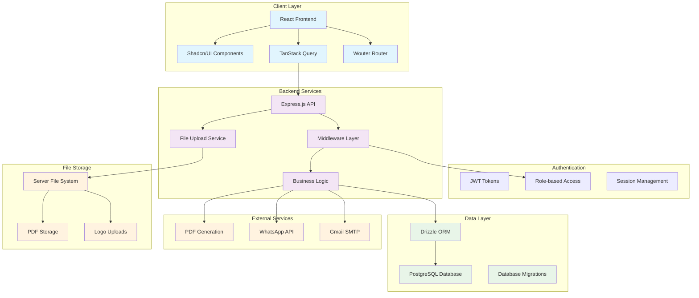
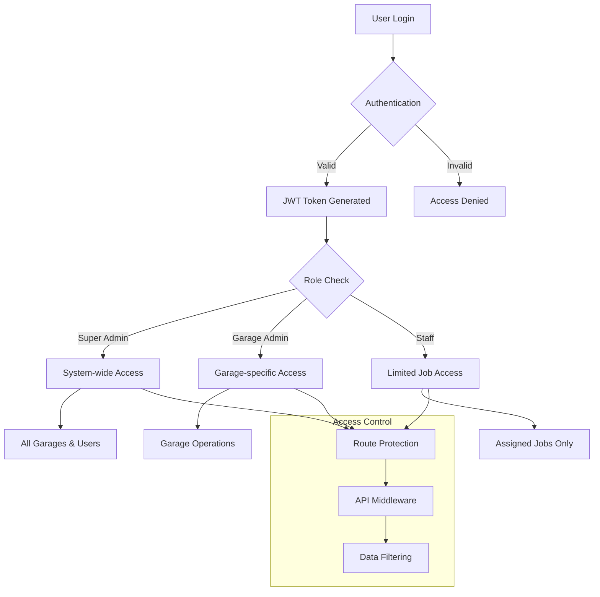
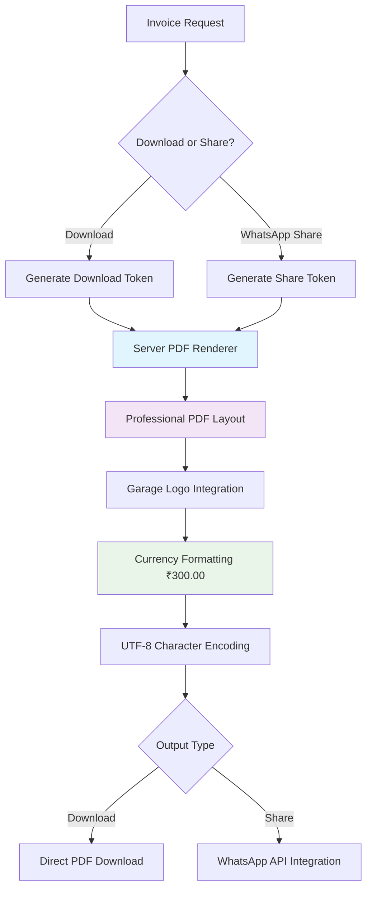
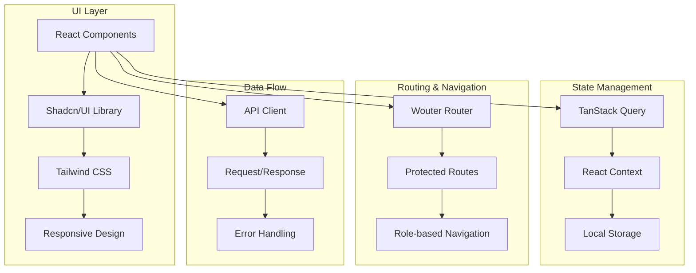
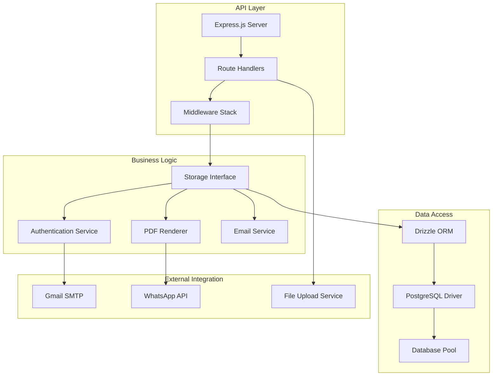

# GarageGuru - Complete Project Report

## Executive Summary

**GarageGuru** is a comprehensive, multi-tenant garage management system designed to streamline operations for automotive service businesses. The application provides a complete solution for managing customers, spare parts inventory, job cards, invoices, and sales analytics with sophisticated role-based access control.

### Business Case
The automotive service industry faces significant challenges in managing day-to-day operations efficiently. Traditional paper-based systems or fragmented digital solutions lead to inefficiencies, lost revenue, and poor customer experience. GarageGuru addresses these pain points by providing:

- **Unified Operations Management**: Single platform for all garage operations
- **Multi-tenant Architecture**: Supports multiple garages with isolated data
- **Role-based Access Control**: Tailored experiences for super admins, garage admins, and staff
- **Mobile-first Design**: Touch-optimized interface for workshop environments
- **Real-time Analytics**: Live sales tracking and profit analysis
- **Professional Invoicing**: PDF generation with WhatsApp integration

### Key Value Propositions
1. **Operational Efficiency**: Reduces manual paperwork and streamlines workflow
2. **Revenue Optimization**: Sales analytics and profit tracking
3. **Customer Satisfaction**: Professional invoicing and service tracking
4. **Inventory Management**: Real-time stock tracking with low-stock alerts
5. **Scalability**: Multi-tenant architecture supports business growth

## System Overview

GarageGuru is built as a modern full-stack web application with the following core technologies:

### Technology Stack
- **Frontend**: React 18 with TypeScript, Shadcn/UI components, Tailwind CSS
- **Backend**: Express.js with TypeScript, RESTful API design
- **Database**: PostgreSQL with Drizzle ORM
- **Authentication**: JWT-based with role-based permissions
- **File Storage**: Server-side file uploads with multer
- **PDF Generation**: Server-side rendering with professional formatting
- **Email Integration**: Gmail SMTP for notifications and OTP delivery

### Architecture Principles
- **Mobile-first Responsive Design**: Optimized for touch interfaces
- **Progressive Web App (PWA) Ready**: Offline capabilities and app-like experience
- **Multi-tenant SaaS Architecture**: Complete data isolation between garages
- **Role-based Security Model**: Granular permissions and access control
- **API-first Design**: RESTful backend with clear separation of concerns

## Architecture Diagram

## Detailed Module Breakdown

### 1. Authentication Module
- **JWT-based Authentication**: Secure token-based authentication system
- **Role-based Access Control**: Three distinct user roles with specific permissions
- **Session Management**: PostgreSQL-backed session storage
- **Password Security**: bcrypt hashing with salt
- **Password Reset**: Secure OTP-based password reset via email

**User Roles:**
- **Super Admin**: System-wide access, garage management, user provisioning
- **Garage Admin**: Full garage operations, staff management, analytics
- **Staff/Mechanic**: Job card management, customer interaction

### 2. Dashboard Modules

#### Admin Dashboard
- **Sales Overview**: Real-time revenue and profit metrics
- **Job Management**: Pending and completed service tracking
- **Low Stock Alerts**: Inventory monitoring with threshold warnings
- **Staff Activity**: Team performance and access request management
- **Analytics Charts**: Visual representation of business metrics

#### Staff Dashboard
- **Personal Job Queue**: Individual task management
- **Recently Completed**: Quick access to finished work with invoice links
- **Customer Search**: Integrated customer lookup and selection
- **Inventory Access**: Parts lookup and stock verification

### 3. Customer Management
- **Customer Profiles**: Comprehensive customer information storage
- **Service History**: Complete record of all services performed
- **Duplicate Prevention**: Automated duplicate detection by bike number
- **Search and Filter**: Advanced customer search capabilities
- **Mobile-optimized UI**: Touch-friendly customer interaction

### 4. Job Card Management
- **Service Tracking**: Complete job lifecycle management
- **Parts Integration**: Direct spare parts addition to job cards
- **Status Management**: Pending, in-progress, completed workflow
- **Staff Assignment**: Job assignment and completion tracking
- **Work Summary**: Detailed service documentation

### 5. Inventory Management
- **Spare Parts Database**: Comprehensive parts catalog
- **Barcode Integration**: Multiple scanning technologies for parts lookup
- **Stock Management**: Real-time quantity tracking
- **Low Stock Alerts**: Automated threshold-based notifications
- **Cost Price Tracking**: Profit margin calculation
- **Duplicate Prevention**: Part number-based duplicate detection

### 6. Invoice System
- **Professional PDF Generation**: Server-side rendering for consistency
- **Custom Branding**: Garage logo integration
- **WhatsApp Integration**: Direct invoice sharing
- **Currency Formatting**: Proper Indian Rupee formatting (₹300.00)
- **Download Token System**: Secure invoice access
- **Single Source of Truth**: Identical PDFs for download and sharing

### 7. Sales Analytics
- **Revenue Tracking**: Service charges and parts sales
- **Profit Analysis**: Cost-based profit calculation
- **Daily Statistics**: Real-time daily performance metrics
- **Historical Data**: Cumulative sales and profit tracking
- **Visual Charts**: Interactive charts using Recharts

### 8. Super Admin Module
- **Environment-based Access**: Secure activation code system
- **Garage Provisioning**: New garage setup and configuration
- **User Management**: Cross-garage user administration
- **Access Request Processing**: Email-based approval workflow
- **System-wide Analytics**: Multi-garage performance overview

## Role and Security Model

### Security Architecture

### Permission Matrix

| Feature | Super Admin | Garage Admin | Staff |
|---------|-------------|--------------|-------|
| System Management | ✓ | ✗ | ✗ |
| Garage Setup | ✓ | ✓ | ✗ |
| User Management | ✓ | ✓ (own garage) | ✗ |
| Sales Analytics | ✓ | ✓ | ✗ |
| Job Card Management | ✓ | ✓ | ✓ (assigned) |
| Customer Management | ✓ | ✓ | ✓ (read-only) |
| Spare Parts | ✓ | ✓ | ✓ (read-only) |
| Invoice Generation | ✓ | ✓ | ✓ |

## PDF Invoice Pipeline

### Single Source of Truth Architecture

The invoice system uses a unified server-side PDF renderer to ensure pixel-perfect consistency between downloaded invoices and WhatsApp-shared links.

### PDF Generation Features
- **Consistent Rendering**: Single codebase for all PDF outputs
- **Professional Formatting**: Clean, business-ready invoice layout
- **Logo Integration**: Dynamic garage logo embedding
- **Currency Formatting**: Proper Indian Rupee display (₹300.00, never ₹300.0)
- **UTF-8 Support**: Full Unicode character support
- **Mobile Optimization**: PDF layout optimized for mobile viewing

## Technology Architecture

### Frontend Architecture

### Backend Architecture

## Deployment Architecture

GarageGuru is designed for cloud deployment with the following components:

### Production Environment
- **Frontend**: Static files served via CDN
- **Backend**: Node.js server on container platform
- **Database**: Managed PostgreSQL service
- **File Storage**: Server-side file system with CDN caching
- **Email Service**: Gmail SMTP with app passwords

### Deployment Targets
- **Primary**: Render.com (recommended for full-stack applications)
- **Alternative**: Vercel + separate database hosting
- **Development**: Local development with PostgreSQL

This comprehensive report provides the foundation for understanding, maintaining, and extending the GarageGuru application. Each subsequent document in this documentation suite provides detailed implementation specifics for different aspects of the system.